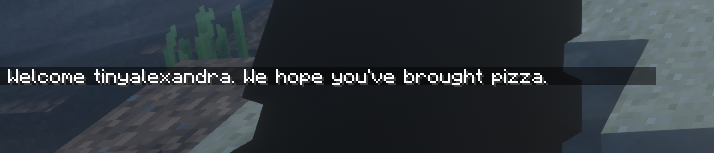

# DiscordJoinMessages
Spigot plugin to send one of Discord's random welcome messages when a player joins

## Preview

## Installation
1. Drag and drop the `.jar` into your `plugins` folder

## Compatibility
- Minimum spigot version: 1.12-R0.1-SNAPSHOT
- Tested on spigot 1.18.2

## Compiling
- Clone this repository, open it with IntelliJ and click run

## License
[MIT](https://github.com/Traurige/DiscordJoinMessages/blob/main/LICENSE)
